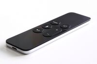
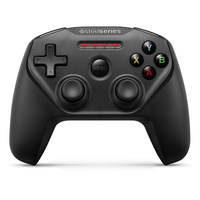
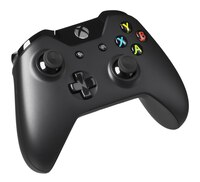
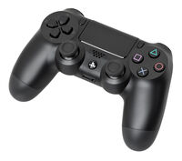

# Controllers-for-tvOS
## Sample app for tvOS that reads and identifies game controllers

This code sample demonstrates how to use game controllers in tvOS apps. It shows all the controllers on a system.

Written by Steve Sparks (@stevesparks) for Big Nerd Ranch. iOS 13 additions by Todd Laney (@ToddLa).

## Types of supported controllers

<ul>
<li>The Apple Remote:

<li>First gen controllers such as the SteelSeries Nimbus:

<li>Also now the XBOX ONE controller:

And the PlayStation DUALSHOCK 4:

